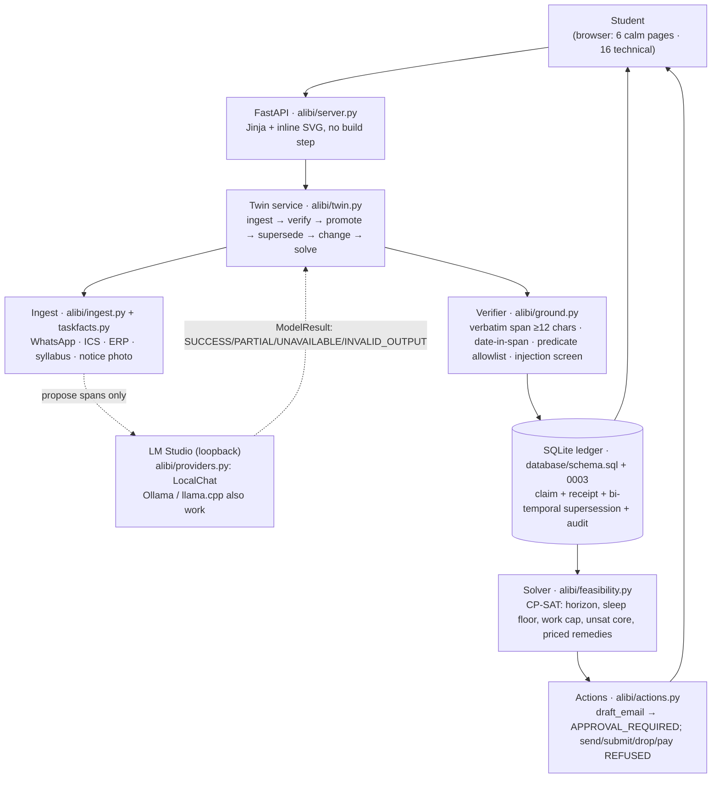

# ALIBI — the receipted academic twin

*An AI assistant for a student's academic life whose model may only **read**. Every fact is proven against the
document it came from, every decision is made by deterministic code that can be re-run, and every number on
screen is a `COUNT` over rows — not a claim about the system that only the system can check.*

```
LLM proposes. ALIBI proves. And when ALIBI cannot prove, it asks — it never guesses in your name.
```

The problem it exists for: existing tools (and ChatGPT) solve **input** — get deadlines into a list. The damage
happens at **decisions and follow-through**, where a confident sentence is indistinguishable from a checked
one. So nothing here is trusted because a model said it.

---

## Run it in four commands

```bash
make setup                           # ./.venv + the 7 pins (ortools, fastapi, uvicorn, jinja2, python-multipart, pytest, httpx)
source .venv/bin/activate            # optional: every target finds ./.venv on its own, so `make` needs no activation
cp .env.example .env                 # optional; an empty .env is a valid, fully-offline configuration
make dev                             # diagnoses the environment, seeds the demo corpus if empty, serves :8000
```

The two `pip`/`venv` lines the quick start used to require are now one target, because the second and third
commands are optional while the first was two steps people got wrong. `make setup` is idempotent: it creates
`./.venv` only if it is missing, and `pip install -r` is a no-op when the pins are already satisfied.

Open <http://localhost:8000>. Then, anywhere:

```bash
make verify                          # 199 tests + the probes + the HTTP smoke run, ~15s, no GPU, no key
python3 -m alibi.cli status          # the same numbers the UI shows, from the same rows
curl -s localhost:8000/api/health | python3 -m json.tool
```

Fresh-database numbers, produced by the last `make verify` on this machine:

```
ALIBI · mode=rules_only local=regex-extractor-v1 cloud=off
  sources 6 · claims 18 · grounded 18 · in review 0 · superseded 0
  conflicts open 3 · reviews 3 · actions pending 0
  model calls 33 (local 33, cloud 0, 0 bytes out) · invalid outputs 0
  18 of 18 facts re-checked on read · nothing wrongly trusted   (unverifiable: 0)
  tasks tracked 10 · 30 change(s): 18×new requirement, 8×feasibility status changed, 3×date changed
```

That fourth line is the same sentence Home shows, because `alibi.cli status` and the UI call one function for
it (`present.trust_words`). On a cold ledger neither of them prints `0 / 0 = 0.00%`; both print *"Nothing has
been read yet, so there is nothing to verify — ALIBI does not fill this in."* The raw counters stay available
at `/metrics` and `/api/health` for scripts that want numbers, not prose.

The corpus contains three instruction-shaped passages: one (a forged “circular” inside the chat export) is
quarantined as a block and never becomes a row; the other two are *legitimate* prose that merely contains
the words “ignore” and “supersedes” — they are deliberately not censored, because deleting a student’s real
deadline to punish a word is not a defence. Re-running the sync adds nothing: 18 claims, 3 conflicts,
`promoted=0` per source, and `injections_quarantined` unchanged at 1.

## With LM Studio (the AI runtime this is built for)

LM Studio serves an OpenAI-compatible API on a loopback port, needs no key, and keeps every byte on the
machine. Nothing else about the product changes: the model proposes spans, the verifier still decides.

```bash
# 1. LM Studio → Install Model → e.g. qwen2.5-7b-instruct (any instruct model that can emit JSON works)
# 2. LM Studio → Developer → Start Server       (default: http://127.0.0.1:1234/v1)
curl -s http://127.0.0.1:1234/v1/models | head -c 200        # must list your model id

# 3. .env — copy the URL straight out of LM Studio's own UI; `http://` is honoured, not forced to TLS
ALIBI_MODE=local
LM_STUDIO_BASE_URL=http://127.0.0.1:1234/v1
LM_STUDIO_MODEL=qwen2.5-7b-instruct      # optional; "" = whatever the server lists first

# 4. restart and prove the round trip
make dev
curl -s "localhost:8000/api/ai-check?dry=false" | python3 -m json.tool
python3 -m alibi.cli sync
```

`make dev` prints one honest line about the runtime before starting anything:

```
  LM Studio   up — qwen2.5-7b-instruct            # or: not reachable (URLError) — the app runs rules-only
  LM Studio   up, but 'llama3.1:8b' is not loaded  ← loaded: qwen2.5-7b-instruct   (it will NOT swap models silently)
```

**Close LM Studio mid-demo and re-sync** — that is the demonstration reviewers care about: extraction falls
back to the rules path, one `EXTRACTION_UNAVAILABLE` review is opened per source, `/api/health` reports
`ai: degraded` (never `healthy` without a model, never a crash), every page still renders, and the ledger
still shows `false trust 0`. `ALIBI_MODE=local` also refuses cloud escalation structurally; the egress meter
is derived from the address (`is_loopback`), so `http://192.168.1.9:1234/v1` is treated as cloud.

## Architecture



Nothing in the dashed box can write to the ledger directly: `verify_claim` is the only door, and
`stats()["false_trust_count"]` re-checks every trusted row against its source on read.

| module | job |
|---|---|
| `alibi/ground.py` | the deterministic verifier: verbatim span, date-in-span, predicate allowlist, injection screen |
| `alibi/link.py` | the gold-span oracle + the attribution probes the harness and `checks/` run (not shipped in the request path) |
| `alibi/changes.py` | change detection: what a re-read actually altered, as typed rows |
| `alibi/taskfacts.py` | title shapes, clause windows, the date grammar — the attribution contract |
| `alibi/ingest.py` | WhatsApp / ICS / ERP / LMS / syllabus readers, block splitting, ICS writer |
| `alibi/ledger.py` | claim upsert, supersession tiers, attendance closed form, conflict records |
| `alibi/db.py` | SQLite access, migrations (one file per transaction), lineage, `stats()` |
| `alibi/feasibility.py` | CP-SAT feasibility, minimal unsat core, remedies priced against the policy |
| `alibi/providers.py` | LM Studio / Ollama / cloud escalation, redaction, budget, `is_loopback` |
| `alibi/actions.py` | the gate (deny list outranks the policy), drafts, approvals |
| `alibi/twin.py` | the service that composes all of it; the CLI and the web app call the same object |
| `alibi/server.py` | 45 routes — the six calm destinations, the 16 technical surfaces, `/api` reads and decisions, the health probes, the SVG graph |
| `alibi/present.py` | **the only module allowed to turn state into sentences** — the language contract behind the six calm pages, tested in `tests/test_renovation.py` |

## The interface: a command centre, not a dashboard

Six destinations, one of which answers "what matters now" and none of which is a grid of panels:

| | |
|---|---|
| **Home** `/` | the count in words ("7 things need you"), what is due, the plan verdict, what changed, one line on why to trust it |
| **Calendar** `/calendar` | month grid + agenda, only dates a source states; a day with nothing on it is left empty |
| **Tasks** `/tasks` | every obligation with its effort (learned, or labelled *assumed*), its weight, its receipts |
| **Review** `/review` | the questions only a human can answer — two dates, a superseded fact — one decision per card |
| **Evidence** `/evidence` | claim → the exact words → offsets → verification, searchable and per-subject |
| **Settings** `/settings` | model routing, retention, the fluid-layer veto, and the door to Advanced |

The eleven technical surfaces did not move out of the product, they moved out of the way: `/technical` groups
them (claims, lineage, subject graph, review queue, conflicts, solver, risk, evaluation, data routing, audit,
docs, the cockpit's field of facts) and every old URL still resolves. `/settings` keeps its full form surface.

Three rules the code is obliged to keep:

* **Progressive disclosure, four layers, never more than one open**: headline → what ALIBI thinks → *why* (a
  `<details>` with sources, claim count and the raw ISO date) → the receipts, one link away.
* **Absence is shown as absence.** A cold database says *"Nothing has been read yet, so there is nothing to
  verify — ALIBI does not fill this in"* rather than rendering `0 of 0`, and `/` redirects to `/onboard`
  because it has no answer to the one question it exists to answer.
* **A card never picks a date for you.** Two dates on file means `due=None` plus "Two dates on file — you
  choose", ordering on the earliest, and a link into Review.

`alibi/present.py` is the only place internal state may become a sentence ("Ia 2" is `IA 2`,
`2026-08-28` is `Was due Fri 28 Aug · 17 days ago`, `ai: degraded` is *"No language model is running, so the
deterministic reader did the extraction"*); templates render what it returns and never re-derive meaning. The
cinematic layer (WebGL atmosphere, inertial scroll, cursor, the field of facts) is now the technical pages'
only, and the reader can veto it from Settings for the whole browser. `docs/UI-DESIGN.md` is the contract;
`tests/test_renovation.py` and `node .tools/verify-fluid.mjs` are what keep it honest.

## What it is, in four mechanisms

1. **A receipt, not a citation.** Every claim stores `(subject, predicate, value, source_id, verbatim
   evidence_span, char_start, char_end, verify_state, method, valid_from, valid_to)` plus a `claim_evidence`
   row naming the verifier, the checks that passed and the model, if any. "Unsupported claims are prevented
   from becoming trusted state" is a stronger and more testable claim than any accuracy number.
2. **Attribution, or the check everyone forgets.** A true sentence attached to the wrong task is worse than a
   missing one, because it wins the argument. A fact is claimed only when title, date and deadline wording sit
   in one window; relative dates are never resolved by rules; an ambiguous line yields a review, not a coin
   flip. The control ("attribute every date to every task") passes the verifier at 1.00, gets 77.8 % of gold
   dates right, and reconciles 2/9 tasks.
3. **Newer ≠ stronger.** Supersession is recency-*within*-a-tier and authority-*across*-tiers
   (`supersede_trust_floor = 0.5`): a WhatsApp message cannot retire a receipted LMS record — it opens a MEDIUM
   escalation, and both rows stay visible. Disagreement is never silent deletion.
4. **The solver, not a forecast.** A 14-day CP-SAT model (fixed sessions, sleep floor, per-day cap,
   `earliest_safe` conflict resolution); on `INFEASIBLE` it extracts a core and prices remedies. Here:
   `core=['no_miss']`, `slack_hours=-3.0`, both remedies refused with
   `cost_class=violates_your_sleep_floor`, and a head-line that says *"no submission on file is an absence of
   evidence, not proof that it was missed"*. It then drafts the extension email — and never sends it.

## Read the docs in this order

| file | what it settles |
|---|---|
| `FINDINGS.md` | 35 findings, 14 of them "my design claim was wrong", all reproducible |
| `docs/ARCHITECTURE-DECISIONS.md` | 32 decisions with the rejected alternative and the measured price |
| `docs/THREAT-MODEL.md` | 12 threats incl. prompt injection via ingested content, with code refs and results |
| `docs/CONFIGURATION.md` | every env var the code reads, routing, LM Studio, redaction, failure modes |
| `docs/API-REFERENCE.md` | all 33 routes, the error contract, why a draft 404/409s instead of guessing |
| `docs/UI-DESIGN.md` | the calm layer and the fluid layer, the six destinations, the language contract in `present.py`, the reader's veto over motion, and the cascade-order trap that ate a tablet nav |
| `docs/DEPLOYMENT.md` | laptop, LM Studio, container, air-gapped, systemd; retention, backup, rollout order |
| `docs/DEMO-WALKTHROUGH.md` | a 12-minute live script: startup, verification, 10 steps, failure demos, teardown |
| `EVAL_REPORT.md` | the four-variant table, generated — `/eval` renders this file, never a copy |
| `00-PROJECT-ARCHITECT.md` | the original brief the build was measured against |

## The rest of the surface

```bash
make test          # 199 tests (~30s), incl. tests/test_renovation.py: the six destinations + the language contract
make smoke         # boots on an EMPTY db, seeds, renders all 24 pages (200, or 302→/onboard when cold), /static/*, traversal, the manual-answer loop
make browser-check   # 111 checks in Chromium across both design systems (`make setup-browser` installs what it needs, once; ~5 min, software-rasterised WebGL): the fluid layer paints, the calm pages carry no canvas/cursor/inertia at 4 viewports and the evidence rows never clip, both sync round trips report in one sentence
make checks        # focused probes: verifier edges, attribution, scenario calibration
make eval          # regenerate EVAL_REPORT.{md,json} (zero model calls needed)
make serve | seed | retention | docker | docker-llm | lint | clean
python3 -m alibi.cli {status|sync|ingest FILE|why TASK|conflicts|plan [--draft]|retention|serve}
```

## What this repo proves, not asserts

| Claim | Where it is checked |
|---|---|
| A hallucinated or mis-copied date cannot become trusted state | `test_hallucinated_date_is_rejected`; `false_trust_count` recomputed on every read |
| An invented quote cannot enter at all | `test_invented_span_is_rejected` (`span_not_verbatim`) |
| A prompt-injection payload is refused **even when quoted verbatim under an allowed predicate** | `test_instruction_shaped_value_is_never_promoted`, `injections_quarantined=2` |
| Over-attribution is corruption, not noise | `naive_attribution` row: 25 claims, pass 1.00, 2/9 reconciled |
| Chat is scoped per message; a departmental notice is not one subject | `tests/test_attribution.py` (22 tests) |
| A class rumour cannot silently retire the syllabus | `test_a_rumour_cannot_retire_the_syllabus` |
| Re-ingest adds nothing — including nothing from the model fallback | `test_re_ingest_is_still_idempotent_after_attribution_changes`, `test_the_sync_banner_reports_what_the_database_actually_holds` |
| Fact identity is enforced by the database, not by one caller | `test_0003_collapses_span_duplicates_without_losing_history`, `ux_claim_fact` |
| A clock time is never read as a year; a bare `10.10` is never a date | `test_a_clock_time_is_never_read_as_a_year` |
| The overcommitted week is provably impossible, and the arithmetic is shown | `test_horizon_is_infeasible_without_the_extension` |
| Working harder is offered but never ranked above an extension | `test_working_longer_is_offered_but_never_ranked_above_an_extension` |
| A past-due task with no receipt is reported, not asserted | `test_no_evidence_of_submission_is_reported_and_not_asserted` |
| A draft quotes the cited clause or admits the policy is unknown | `test_the_penalty_in_a_draft_comes_from_a_clause_or_is_admitted_as_absent` |
| A human answer becomes a claim with its own receipt, or is refused | `test_use_my_answer_becomes_a_claim_not_only_a_closed_inbox_item` |
| Nothing is ever sent | `test_an_approved_draft_is_rendered_not_sent_and_cannot_be_decided_twice` |
| Wipe is a verified DELETE; retention reports what it cost | `test_wipe_requires_the_keyword_and_reports_the_real_counts`, `test_retention_drops_text_and_reports_the_loss_rather_than_hiding_it` |
| LM Studio's documented URL works, and every failure mode is a value not a crash | 45 tests in `tests/test_providers_and_time.py` against a real local HTTP server |
| The page is correct with no CSS/JS, and the client layer has no HTML-injection surface | `test_the_page_works_with_and_without_the_enhancement_layer` |
| The docs page is not a file-read primitive | `test_docs_route_cannot_be_turned_into_a_file_reader` + smoke's traversal → 404 |

## Troubleshooting

| symptom | cause and fix |
|---|---|
| `ModuleNotFoundError: ortools` (or fastapi) | `pip install -r requirements.txt`; `make dev-check` lists exactly what is missing |
| `/readyz` 503 while pages render | the ledger is empty by design — a container that has ingested nothing is *unhealthy on purpose*. `POST /api/sync` or `make seed` |
| `ai: degraded` on `/api/health` | LM Studio is not answering. `reason` says whether the port is closed or the model is not loaded; `hint` says what to click. Set `LM_STUDIO_MODEL` to an id in `/v1/models` |
| `SSL: WRONG_VERSION_NUMBER` | only possible if a *non-loopback* host is forced onto plain HTTP. Use `http://` for loopback, `https://` for anything else |
| every table renders empty | two databases in play: check `ALIBI_DB` vs `DATABASE_URL`; `/api/health` prints the file it actually opened |
| `claims 0` after a re-sync | correct — identical bytes are the same source (`UNIQUE(sha256, kind)`) and the run added no rows |
| `INFEASIBLE`, `slack_hours=-3.0` on a past date | also correct — a deadline at/before the horizon start has no legal time left, and "no submission on file" is not a verdict about you |
| `unverifiable` climbing | the retention job ran; quotes survive, documents do not. `python3 -m alibi.cli retention --days N` |
| a `500` on any page | a template bug, not a data bug — run `python3 scripts/smoke.py`, which names the page |
| `/` redirects you to `/onboard` | correct on an empty ledger: Home answers "what matters now" and has nothing to answer with. Load the sample corpus from that page, or `make seed`; `/?demo=1` skips the redirect |
| the calm pages feel flat, no glow, no parallax | that is the design: the fluid layer belongs to the technical pages. It is there on `/technical/cockpit` — if it is missing there too, `localStorage` has `alibi.fluid.off=1` (Settings → Reading preferences turns it back on) or your OS asks for reduced motion |
| the mobile nav bar shows two rows, or overlaps content | a CSS regression: the bar must be one horizontally-scrollable row. `node .tools/verify-fluid.mjs` measures its height and tap targets at 390px |
| a `calm.css` rule appears not to apply | check the emission order in `base.html`, not the selector: layer 1 (inline) must come **before** the `<link>`, or the fallback silently wins on source order |
| a broken/migrated-sideways database | the recovery is `rm alibi.db && make seed` *because* the ledger is derived from a corpus in this repo; on a real installation, restore the file (see `docs/DEPLOYMENT.md`) |
| port already in use | `PORT=8080 make dev` (honoured by `make serve` too); the container maps `8000:8000` and `docker compose down` releases it |
| `ModuleNotFoundError: ortools` / `fastapi`, or `make test` says `No module named pytest` | the interpreter has no deps — usual cause is a fresh clone, or a VM/sandbox that persisted the repo but dropped generated directories (`.venv`, `node_modules`, `~/.cache`) like this one does. Fix: `make setup`. `make dev` diagnoses exactly this and prints the same remedy rather than a traceback |

## What is *not* proven here, stated plainly

Extraction recall on the shipped no-model path is **10 of 14** claims and **5/9** gold obligations — the
`rules_line` row measures that floor rather than quoting the oracle. The demo corpus is mine, written by the
party being evaluated; read it as an argument about mechanism, not a benchmark. OCR on a photographed page, a
real 60-item gold set, live ICS read-back and any corpus larger than six artefacts are open (`00-PROJECT-ARCHITECT.md`
§22). There is no authentication: this is a single-student tool, and `docs/THREAT-MODEL.md` T10 says so
instead of implying otherwise.
